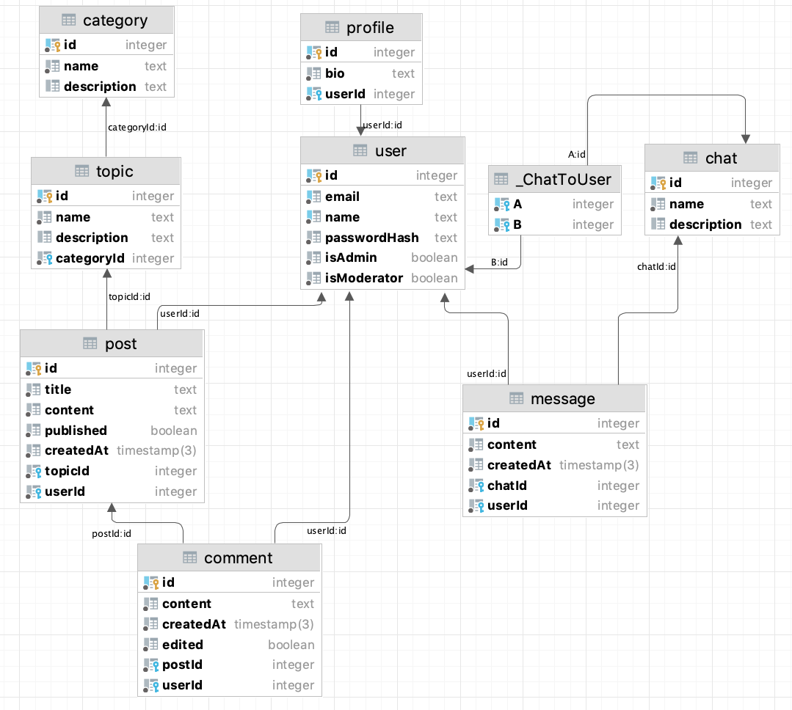

##Проект по Web-программированию
mrskycriper-itmo-web  
Автор: Салимов Сергей  
Группа: M33011
###Архитектура базы данных

Все построено вокруг аккаунта пользователя - сущности User. У каждого пользователя отдельно имеется свой профиль с опциональной биографией.  
Существуют 2 независимых блока на форуме: чаты с сообщениями (Chat, Message) и система из категорий, топиков и постов с комментариями (Category, Topic, Chat, Comment).    

Чаты содержат список участников и оставленных ими сообщений. Имя и описание опциональны. Сообщения имеют привязку к автору, дату создания и привязку к конкретному чату.  

Категории на форуме являются самой крупной единицей деления для системы постов, в категориях находятся топики которые уже содержат внутри себя индивидуальные посты. К постам прикрепляются комментарии. Посты состоят из заголовка и контента, а так же могут находиться в неопубликованном виде.

Так же на форуме имеется рудиментарная система ролей которые хранятся у пользователя (User). На данный момент имеются 3 возможных роли: USER, MODERATOR и ADMIN. Подразумевается что большинство пользователей имеют роль USER, за модерацию контента на форуме отвечают специальные пользователи с ролью MODERATOR. Роль модератора назначается пользователем с ролью ADMIN который ее имеет по праву "владения" форумом.